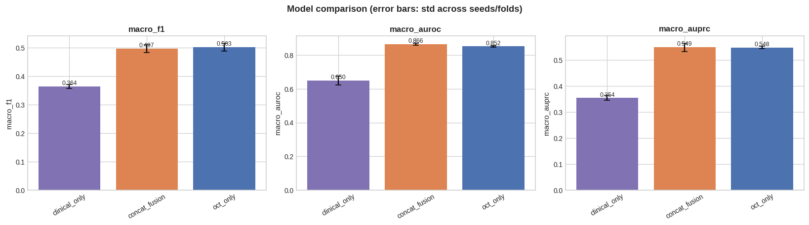
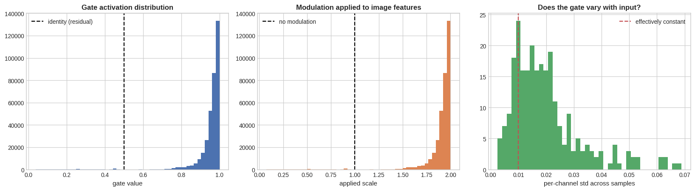
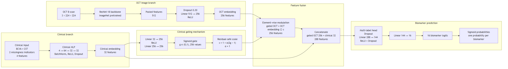
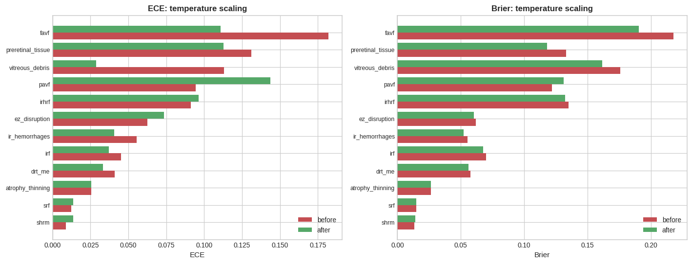
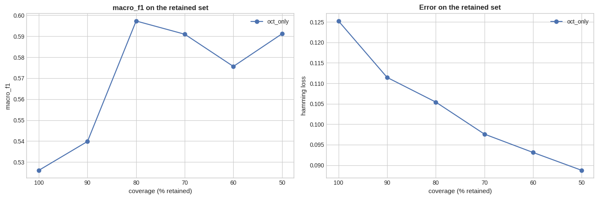
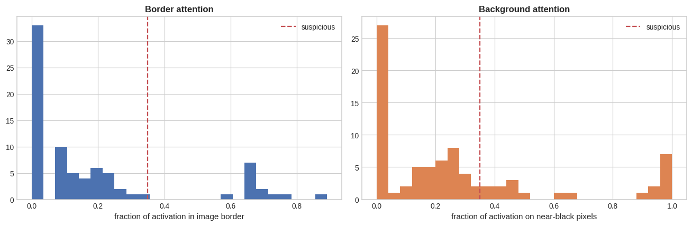
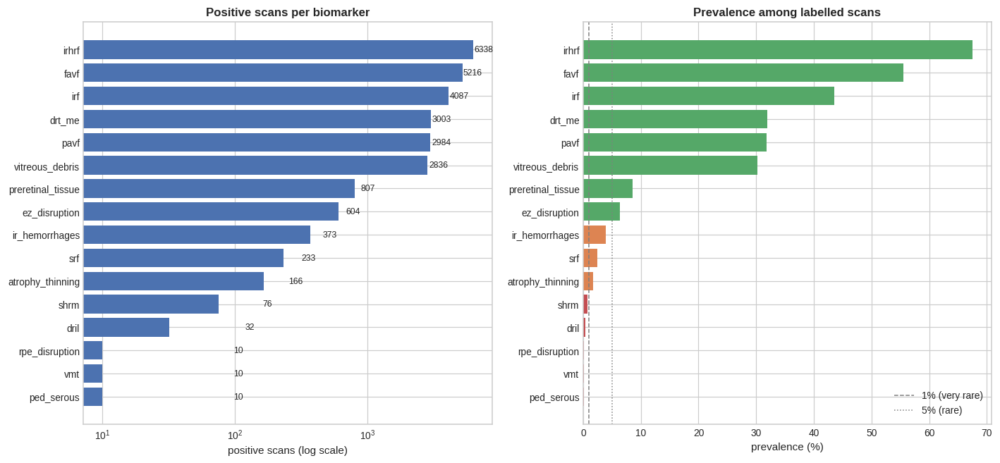

# Clinically grounded, uncertainty-aware multimodal retinal biomarker detection

This project detects retinal biomarkers in OCT B-scans from the **OLIVES** dataset. It compares
image-only models with models that also use BCVA and CST from the same visit. The evaluation
includes probability calibration, uncertainty estimates and explanations for individual labels.

Owner: Blessing Asare | Framework: PyTorch | Status: Phases 0-5 completed on an NVIDIA A100. The proposed gated fusion did not outperform the OCT-only baseline.

---

## Research question

> Does adding visit-level BCVA and CST to OCT features improve multilabel retinal biomarker
> detection? If it does, is the improvement caused by useful clinical information or by the model
> recognising individual visits?

The answer may be no. A clinical fusion model that fails to beat a well-controlled OCT baseline is
still an informative result, provided that the comparison is fair. The evaluation was designed
with that possibility in mind.

The second question matters because `(BCVA, CST)` identifies the visit uniquely in **97-100% of
cases in every fold**. A fusion model could therefore improve by learning visit identity. Such a
gain would be unlikely to transfer to another clinic and would not count as evidence that the
clinical measurements help. The control experiments below are intended to separate these two
possibilities.

---

## A100 results

The four models were evaluated with seeds 42, 43 and 44 on one fixed patient-grouped holdout:
52 training, 13 validation, 9 calibration and 13 test patients (1,372 test scans). Thresholds
were fitted on validation only. Macro metrics omit the three labels with no positive test
examples (DRIL, VMT and serous PED).

| Model | Macro F1 | Macro AUROC | Macro AUPRC |
|---|---:|---:|---:|
| Clinical only | 0.3644 | 0.6500 | 0.3541 |
| OCT only | **0.5026** | 0.8522 | 0.5478 |
| Concatenation | 0.4971 | **0.8660** | **0.5492** |
| Gated fusion | 0.4979 | 0.8551 | 0.5413 |

The image carries most of the useful signal. OCT outperformed BCVA and CST alone, while simple
concatenation was effectively tied with the OCT model. Gated fusion was 0.0065 lower in macro
AUPRC and 0.0047 lower in macro F1 than OCT. On this cohort, the proposed gate did not improve
the primary endpoint. The pipeline worked as intended; the model comparison was negative.



### Gate mechanism

The gate did respond to the clinical measurements. Its Spearman correlation was 0.8768 with CST
and -0.3875 with BCVA, and its largest biomarker effects were for DRT/ME, SRF and IRF. The problem
was how it used that information. Its mean scale was 1.8971 out of a maximum of 2, 97.78% of
channels were amplified, and 20.31% were essentially constant. Variation between samples was
small. In practice, the gate behaved mostly like a global amplifier and did not improve the
predictions.





### Single-seed follow-up experiments

The Phase 3 follow-up runs used the same patient-grouped holdout. Two ablations checked whether
the missingness indicators or the residual-safe gate explained the original result. The
longitudinal models applied a bounded, per-biomarker logit correction based on clinical change
within each eye. These experiments used seed 42 only, so they are exploratory rather than
three-seed estimates.

| Experiment | Seed | Macro F1 | Macro AUROC | Macro AUPRC |
|---|---:|---:|---:|---:|
| Gated fusion | 42 | 0.4988 | 0.8528 | 0.5335 |
| Gated, no missingness indicators | 42 | 0.4574 | 0.8319 | 0.5338 |
| Gated, raw multiplicative scale | 42 | 0.4779 | 0.8604 | 0.5146 |
| Longitudinal absolute + within-eye change | 42 | 0.4856 | n/a | **0.5721** |
| Within-eye change only | 42 | 0.4643 | n/a | **0.5616** |

Compared with the seed-42 OCT reference (macro F1 0.5189, macro AUPRC 0.5476), the longitudinal
model gained 0.0245 AUPRC but lost 0.0333 F1. The change-only model gained 0.0140 AUPRC and lost
0.0546 F1. The higher AUPRC is worth following up, but it does not show that clinical change
improves the model. There is only one seed, Phase 5 did not have the contender checkpoints for a
paired patient bootstrap, and F1 moved in the opposite direction. The comparison needs persistent
checkpoints, repeated seeds and paired tests before it can support that claim.

### Calibration and selective prediction

The calibration analysis used the persistent OCT-only seed-42 run. Temperature scaling reduced
mean ECE from 0.0720 to 0.0609 and the Brier score from 0.0902 to 0.0855 across the 12 labels with
enough positive examples to interpret. Macro F1 was 0.5261 after validation thresholds were
refitted on the calibrated probabilities. As expected, calibration did not change the ranking
metrics.

MC dropout uncertainty was associated with scan error (Spearman rho 0.5319). When the most
uncertain 20% of scans were set aside, macro F1 rose from 0.5261 to 0.5983 and macro AUPRC rose
from 0.5476 to 0.6183. The highest observed macro F1 was 0.5994 at 70% coverage. This was a
retrospective selective-prediction analysis and should not be read as evidence of deployment
performance.

| Calibration | Selective prediction |
|---|---|
|  |  |

### Confidence intervals and explainability

For the persistent OCT run, the patient-level bootstrap intervals were macro F1 0.5004
[0.4590, 0.5795], macro AUROC 0.8505 [0.7948, 0.8905], and macro AUPRC 0.5476
[0.5120, 0.6584]. Only the OCT checkpoint was available in persistent Drive storage during this
analysis, so the intervals cannot be used to compare models.

The attention audit covered 80 IRF and DRT/ME heatmaps from 40 test scans. Twenty maps (25%)
placed a suspicious amount of attention on borders or background. The Grad-CAM images are useful
for reviewing individual cases, but they do not prove that the model uses clinically meaningful
features.



## What to try next

The A100 results suggest that the next gains are more likely to come from the input pipeline and
fine-tuning schedule than from a larger model. OCT already matches both fusion models, and the
clinical gate was nearly saturated (mean scale 1.897/2.0, with 97.78% of channels amplified).
That looks more like global gain than selective modulation.

### Changes already implemented

| # | Change | Evidence it addresses | Where |
|---|---|---|---|
| 1 | Deterministic retinal crop before resize | ~45% of pixels near-black; 25% of audited heatmaps on border/background | `RetinalTissueCrop`, `data.crop_retina` |
| 2 | 320px input, aspect-ratio padding, train-fold normalisation | Small biomarkers vanish at 224px from 504x496; measured mean is 0.17 not 0.482 | `configs/oct_improved.yaml` |
| 3 | RETFound ViT-L retinal MAE weights | With 52 training patients, retinal pretraining may be more data-efficient than ImageNet initialisation | `ImageEncoder`, `configs/oct_retfound.yaml` |
| 4 | 2.5D adjacent B-scans as the three channels | Grayscale was copied 3x, wasting the stem; neighbours add volumetric context | `data.image_mode: adjacent`, `configs/oct_adjacent.yaml` |
| 5 | Patient/visit-balanced sampling and class weights | Scan-level shuffling lets high-volume patients dominate the gradient | `GroupBalancedSampler`, `training.sampler` |
| 6 | Discriminative LRs, warmup+cosine, progressive unfreeze | Train loss fell while validation degraded; one flat LR for the whole net | `training/schedule.py` |
| 7 | Asymmetric loss as an ablation | 5 labels below 1% prevalence; weighted BCE still swamped by easy negatives | `AsymmetricLoss`, `configs/loss_asl.yaml` |
| 8 | Bounded fusion replacing the gate | Gate reached ~2x global amplification and lost to OCT-only | `ResidualLogitFusionModel`, `BoundedFiLMFusionModel` |
| 9 | Seed ensembling | 13 test patients makes any single seed unstable | `SeedEnsemble`, `--ensemble` |

### Replacement fusion designs

Both models are initialised to match the OCT baseline. Clinical input only begins to influence
the prediction if training finds that it helps on validation data:

```
residual_logit_fusion:  logits = oct_logits + beta * clinical_logits
                        beta init 0, one bounded coefficient per biomarker

bounded_film_fusion:    scale = 1 + 0.25 * tanh(gamma)
                        modulated = scale * oct_features + shift
```

`ResidualLogitFusionModel.beta_values()` shows how much each biomarker uses the clinical branch.
The expected pattern is a larger CST contribution for DRT/ME, IRF and SRF, with coefficients near
zero for vitreous-face labels. Those coefficients should be reported even if the macro metric does
not change because they address the mechanism more directly than a 0.005 AUPRC difference.

### Suggested experiment order

```bash
# 1. Current OCT baseline (already have it)
# 2. Retinal crop + 320px + staged fine-tuning
python scripts/run_comparison.py --arms B E --seeds 42 43 44 --evaluate --ensemble

# 3-5. 2.5D input, then RETFound (set model.pretrained_checkpoint first)
python scripts/train.py --config configs/oct_adjacent.yaml --seed 42
python scripts/train.py --config configs/oct_retfound.yaml --seed 42

# 6. Loss ablation against the BCE reference
python scripts/train.py --config configs/loss_asl.yaml --seed 42

# 7. Bounded clinical fusion over the best OCT configuration
python scripts/run_comparison.py --arms E G H --seeds 42 43 44 --evaluate --ensemble

# 8. Within-eye clinical context, the arm with a measured mechanism.
#    Pre-register the target labels FIRST; it reads training patients only.
python scripts/preregister_targets.py --folds
python scripts/run_comparison.py --arms E I J --seeds 42 43 44 --evaluate     --preregistered ir_hemorrhages

# 9. The control ladder. Only meaningful if step 8 showed a gain.
python scripts/run_comparison.py --controls --seeds 42 --evaluate

# 10. Five-fold grouped confirmation of the winner
python scripts/make_splits.py --config configs/data.yaml --folds
```

There is little reason to start with a larger backbone or a longer schedule. The current evidence
points instead to unused image area, ImageNet-only pretraining, missing inter-slice context and the
small number of training patients.

The holdout versions of arms I and J have seed-42 results, reported above. They still need
three-seed reruns, a paired patient bootstrap, the control ladder and five-fold confirmation.

### Within-eye clinical context and its controls

Current-visit BCVA and CST overlap with information already present in the B-scan. CST measures
the thickness of the volume being classified, and differences in baseline retinal thickness
account for much of its variation between patients. This helps explain why the A100 gate settled
into near-global amplification.

A single B-scan cannot show how an eye has changed over time. Centring the clinical value and
biomarker state within each eye removes fixed differences between patients. On the training
patients, several biomarkers still have a plausible association with this change: fluid appears
as thickness rises, while atrophy appears as it falls.

`configs/fusion_longitudinal.yaml` (arm I) adds the signed change from each eye's own baseline visit.
`configs/fusion_delta_only.yaml` (arm J) omits the absolute measurements. Its delta is zero at
every baseline visit and a small signed number at later visits, which removes the exact-value
fingerprint. If J beats the OCT reference, exact visit memorisation becomes a less plausible
explanation, although the control experiments are still needed.

| Arm | Control | Information retained | Interpretation if the gain persists |
|---|---|---|---|
| K | `patient_mean` | patient severity, no visit contrast | the gain was never longitudinal |
| L | `within_patient_shuffle` | identity and marginals | the gain was a fingerprint |
| M | `across_patient_shuffle` | marginals only | performance floor; a gain here suggests a bug |
| N | `quantise` | clinical meaning, not exact values | the gain is a clinical effect |

`quantise` bins CST in 25 µm steps and BCVA in 5-letter steps. This reduces exact-value visit
uniqueness from 98.4% to 55.6% while retaining differences that could matter clinically. If the
gain survives this test, the binned features are the safer version to report.

If a control retains most of the gain, it has not passed. The model was probably not using the
information that the control removed.

### Pre-registered targets

`scripts/preregister_targets.py` measures within-eye associations using only the training
patients in each fold. It selects the labels that fusion is expected to help before the test data
is used. A label must have both a plausible association and enough room to improve over the OCT
baseline.

For the executed holdout run, the training-only procedure pre-registered `ir_hemorrhages` and
`ez_disruption`. Across the planned five-fold analysis, only `ir_hemorrhages` qualifies in every
fold:

| fold | qualifying labels |
|---|---|
| 0, 2, 4 | `ir_hemorrhages`, `ez_disruption` |
| 1, 3 | `ir_hemorrhages` |
| **every fold** | **`ir_hemorrhages`** |

`ir_hemorrhages` is therefore the confirmatory set. All other labels remain exploratory.
`atrophy_thinning` illustrates why this restriction matters: it appears strongly associated
(r = -0.49, p = 0.006) when all 87 patients are pooled, but it does not qualify in any fold after
held-out patients are excluded.

### Comparing two arms

Use `ResultsAggregator.paired_difference` for model comparisons. Separate confidence intervals
can overlap because patient difficulty varies, even when the paired difference is consistent.
Resampling the difference removes the part shared by both models. `intervals_overlap` remains in
the descriptive table, but it is not used as a significance test.

### Self-supervised pretraining on OLIVES

If you pretrain on the roughly 70,000 unlabelled scans instead of using RETFound, call
`pipeline.pretraining_frame(assignment)` separately for each fold. Unlabelled scans can still
leak patient information. Pretraining on a held-out patient's scans exposes the encoder to that
patient's anatomy, so the result is no longer an inductive estimate. This method restricts the
pool to training patients and raises an error if a held-out patient appears.

---

## Quick start

```bash
# 1. Install
python -m pip install -e ".[dev]"

# 2. Audit the data (builds the manifest on first run, ~90 s)
python scripts/audit_data.py --config configs/data.yaml

# 3. Patient-grouped splits
python scripts/make_splits.py --config configs/data.yaml --folds

# 4. Export the image cache once (~2.3 GB; also what you upload to Drive for Colab)
python -c "from olives_biomarkers import OlivesPipeline; OlivesPipeline.from_config('configs/data.yaml').export_image_cache()"

# 5. Run the mandatory A-D comparison
python scripts/run_comparison.py --budget local_cpu --evaluate      # CPU: reduced budget
python scripts/run_comparison.py --budget colab_gpu --seeds 42 43 44 --evaluate

# 6. Explore
jupyter lab notebooks/
```

### Notebooks

| Notebook | Phase | Covers |
|---|---|---|
| `01_data_audit_and_eda.ipynb` | 0-1 | Schema, manifest, audit, extensive EDA, split design |
| `02_baselines.ipynb` | 2 | Models A, B, C with pre-flight wiring checks |
| `03_gated_fusion.ipynb` | 3 | Model D, gate analysis, ablations |
| `04_uncertainty_calibration.ipynb` | 4 | MC dropout, temperature scaling, selective prediction |
| `05_explainability_and_report.ipynb` | 5 | Grad-CAM, attention sanity, bootstrap CIs, report |

Each notebook imports classes from `src/`; none reimplements logic. With `%autoreload 2`, editing
a `.py` in VS Code and re-running a cell picks up the change.

Expected data location, configurable via `data.root` in `configs/data.yaml`:

```
data/raw/OLIVES/
├── disease_classification/    # 32 parquet shards, 78,822 rows, 16 biomarkers
└── biomarker_detection/       # VIP-Cup 6-biomarker subset with its own train/test split
```

Download from [`gOLIVES/OLIVES_Dataset`](https://huggingface.co/datasets/gOLIVES/OLIVES_Dataset).
If the data is absent, every entry point exits with the exact path it expected.

---

## What the audit found

These figures come from running the pipeline on the local copy of OLIVES:

| Finding | Consequence |
|---|---|
| 78,822 rows, but only **9,396** deduplicated biomarker-labelled scans from **87 patients** | The effective sample size is the patient count. Patient-level bootstrap CIs only. |
| **21% of rows are byte-identical duplicates** (8,281 groups) | Deduplicate before counting or splitting. No group crosses a patient, so patient-grouping contains them. |
| Biomarkers graded on exactly **2 visits per eye** (first and last) | Matches the paper's protocol; the first/last contrast is a treatment-induced domain shift. |
| Prevalence spans **67% (IRHRF) to 0.06% (serous PED)** | Per-label thresholds, not 0.5. DRIL, VMT and serous PED had no positive test examples; RPE disruption had one. |
| `Scan (n/49)` is present on only **22%** of rows | It belongs to the annotation block. Filter modelling rows on `has_biomarkers`. |
| **No visit/week column**; no fundus; no 3D volumes | Visits are *inferred* from BCVA/CST change-points. Fundus and volume extensions are blocked. |
| BCVA/CST missing for **patient 79 only** | Missingness is concentrated and may be informative. Impute on train and keep an indicator. |
| Measured pixel mean ≈ **0.17**, not the paper's 0.482 | Do not reuse the paper's normalisation constants. |



Full report: `outputs/reports/data_audit.md` (regenerate with `scripts/audit_data.py`).

The pipeline found 9,396 labelled scans compared with 9,408 in the paper, and 292 unique label
vectors compared with the reported 286. These two counts provide a useful check on the local data
extraction.

---

## Design choices

- Splits are made at patient level. `SplitValidator` checks patient disjointness and duplicate
  containment every time, and the tests include deliberately leaky splits that it must reject.

- `ClinicalPreprocessor` raises an error if it is used before fitting. It also rejects an
  accidental refit on a second partition.

- AUROC is undefined when a fold has no positive examples for a label, so the code returns `nan`.
  Macro averages skip those labels and report how many were omitted.

- `ClinicalGate` starts with an applied scale of exactly 1.0. Model D therefore begins as a
  pass-through of the OCT embedding and must learn any modulation. After training, `GateAnalyzer`
  checks whether that happened. If the gate stays at identity, Model D is functionally Model C with
  extra parameters.

- MC dropout enables only dropout layers. Batch normalisation stays in evaluation mode, and a test
  checks that its running buffers do not change during stochastic passes.

---

## Repository layout

```
configs/                     YAML: data, label schema, one file per model
├── label_schema.yaml        Verbatim parquet columns → canonical keys; absent fields recorded
notebooks/
└── 01_data_audit_and_eda.ipynb    Phase 0 analysis front-end
src/olives_biomarkers/
├── config.py                Typed config dataclasses + `defaults:` inheritance
├── pipeline.py              OlivesPipeline: data, audit, splits, image cache
├── experiment.py            ExperimentRunner, RunEvaluator, ExperimentSuite, ResultsAggregator
├── data/                    schema · manifests · audit · splits · preprocessing · dataset
├── models/                  encoders, heads, baselines (A-C), gated fusion (D), registry
├── training/                losses · callbacks · engine
├── evaluation/              metrics · bootstrap · calibration · uncertainty · gating ·
│                            explainability · plots
├── eda/                     analyzer · plots
└── utils/                   environment · logging · reproducibility · io
scripts/                     audit_data · build_manifest · make_splits · train ·
                             run_comparison · evaluate · generate_report
tests/                       synthetic fixture reproducing the real dataset's traps
```

`ExperimentRunner` fixes the evaluation order. Preprocessing and class weights are fitted on the
training partition, thresholds on validation, and calibration on a separate patient-disjoint
partition. The test set is evaluated once. Scripts and notebooks call the same runner, which keeps
their behaviour consistent.

Reusable logic lives in classes under `src/`; the notebooks import it instead of maintaining
separate implementations. With `%autoreload 2`, a notebook picks up changes to a `.py` file when
the cell is run again.

---

## Models

| ID | Model | Clinical influence on the OCT path |
|---|---|---|
| A | `clinical_only` | n/a; measures the signal in BCVA and CST alone |
| B | `oct_only` | none; this is the reference for every fusion claim |
| C | `concat_fusion` | additive, in feature space, via a shared head |
| D | `gated_fusion` | multiplicative gate over every channel, unbounded toward 2x |
| G | `residual_logit_fusion` | additive in *logit* space; one bounded coefficient per biomarker |
| H | `bounded_film_fusion` | multiplicative scale + shift, capped at ±25% |

Model D is the original proposal, and its A100 result did not support the hypothesis. Models G and
H are bounded alternatives that both begin as exact copies of model B.

Model D tests whether the clinical measurements can change how the image features are read. For
example, high CST might increase the weight given to fluid-related image features. A
multiplicative gate can express this interaction directly, while simple concatenation cannot.

CST also has a clear limitation: it is one value for the whole volume and is repeated across all
49 B-scans from a visit, while biomarker labels vary between slices. Clinical features can shift
the prior probability for a scan, but they cannot explain variation within the volume. This limits
the likely effect size for models C and D.

---

## Running on Colab from VS Code

The code detects the runtime and resolves paths accordingly, so nothing needs editing.

```python
pipeline = OlivesPipeline.from_config("configs/data.yaml")
pipeline.env.mount_drive()          # no-op locally
```

Do not upload the 30 GB of parquet. Export just the modelling subset once, locally:

```python
from olives_biomarkers.data.dataset import ImageCacheExporter

exporter = ImageCacheExporter(pipeline.data_root, "disease_classification",
                              output_dir="data/processed/images_labelled")
exporter.export(eda.labelled)       # 9,396 PNGs, 2.3 GB
```

Upload that folder to Drive and set `data.colab.drive_data_subpath`.

### Persistent checkpoints and model bundles

The Colab training notebooks write runs directly to
`/content/drive/MyDrive/olives/outputs/runs/colab_gpu`. Every model/seed run keeps:

```text
<run_id>/
├── checkpoints/<run_id>_last.pt   # full state, replaced atomically after every epoch
├── checkpoints/<run_id>_best.pt   # best validation checkpoint
├── models/<run_id>_model.pt       # best weights + architecture/label metadata
├── resolved_config.yaml
├── clinical_preprocessor.json
└── run_state.json
```

`training.resume_from_checkpoint: true` restores model weights, AdamW state, AMP scaler,
early-stopping patience, metric history, schedule position and random-number states from `last`.
`training.reuse_completed_run: true` loads a finished run without training. Keep the same
model/split/seed run ID when reconnecting to Colab. Phases 2-4 do this automatically.

---

## Testing

```bash
pytest                    # full suite
pytest tests/test_splits.py -v      # the leakage tests
```

Tests use a synthetic dataset built by `tests/conftest.py`. It includes the cases most likely to
break this pipeline: patients with two eyes, 49-scan visits, a repeated visit, adjacent duplicate
rows, missing clinical values and a label found in only one patient. The tests do not require the
real dataset.

---

## Status

- [x] Phase 0: repository, config, schema resolution, manifest, audit and EDA notebook
- [x] Phase 1: patient-grouped holdout and five-fold splits, checked for leakage
- [x] Phase 2: baselines A, B and C (`02_baselines.ipynb`, `scripts/run_comparison.py`)
- [x] Phase 3: gated fusion D, gate analysis and ablations (`03_gated_fusion.ipynb`)
- [x] Phase 4: MC dropout, temperature scaling and selective prediction (`04_uncertainty_calibration.ipynb`)
- [x] Phase 5: Grad-CAM, attention checks, bootstrap CIs and report (`05_explainability_and_report.ipynb`)
- [x] Improvement code: crop/320px, 2.5D input, RETFound support,
      balanced sampling, staged fine-tuning, ASL, two bounded fusion designs, seed
      ensembling. The original-gate ablations and longitudinal bounded-fusion arms have
      seed-42 results; the crop/320px, 2.5D, RETFound, ASL and ensemble arms remain untrained.
- [x] Within-eye clinical context: longitudinal features, the four-rung control
      ladder, pre-registration of target labels, and paired patient-level difference testing.
      The longitudinal and delta-only holdout arms are trained for seed 42; controls, repeated
      seeds, paired bootstrap and five-fold confirmation remain.
- [x] Persistent Colab recovery: atomic best/last checkpoints, full optimiser-state resume,
      completed-run reuse and exported best-model bundles under Google Drive.
- [ ] Phase 6: self-supervised pretraining (fundus and volume extensions are blocked because they
      are not present in this mirror)

The complete pipeline ran on an NVIDIA A100 with 224 px inputs, a 50-epoch budget and three seeds.
The results support OCT over the clinical-only baseline, but they do not support the original
gated fusion over OCT. The longitudinal AUPRC gains come from one seed and remain exploratory.
A final comparison requires Drive-backed reruns for every contender, paired patient-level
bootstrap differences, repeated seeds and five-fold patient-grouped cross-validation.

---

## Data use and citation

OLIVES is released under CC BY 4.0 and derives from the PRIME and TREX-DME clinical trials
(Retina Consultants of Texas), collected under IRB approval and de-identified per HIPAA. Raw
images, manifests and checkpoints are git-ignored and must not be committed.

The cohort comes from a single U.S. clinic with no untreated control group, so nothing here
supports a diagnostic or deployment claim. Biomarkers are retrospectively graded indicators, and
the dataset authors state that they are not causal to disease. This project does not make causal
claims.

```bibtex
@inproceedings{prabhushankarolives2022,
  title     = {OLIVES Dataset: Ophthalmic Labels for Investigating Visual Eye Semantics},
  author    = {Prabhushankar, Mohit and Kokilepersaud, Kiran and Logan, Yash-yee and
               Trejo Corona, Stephanie and AlRegib, Ghassan and Wykoff, Charles},
  booktitle = {NeurIPS Track on Datasets and Benchmarks},
  year      = {2022}
}
```

- Paper: <https://arxiv.org/abs/2209.11195>
- Dataset: <https://doi.org/10.5281/zenodo.7105232> · [Hugging Face mirror](https://huggingface.co/datasets/gOLIVES/OLIVES_Dataset)
- Official code: <https://github.com/olivesgatech/OLIVES_Dataset>
